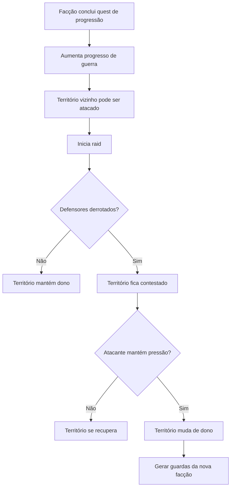
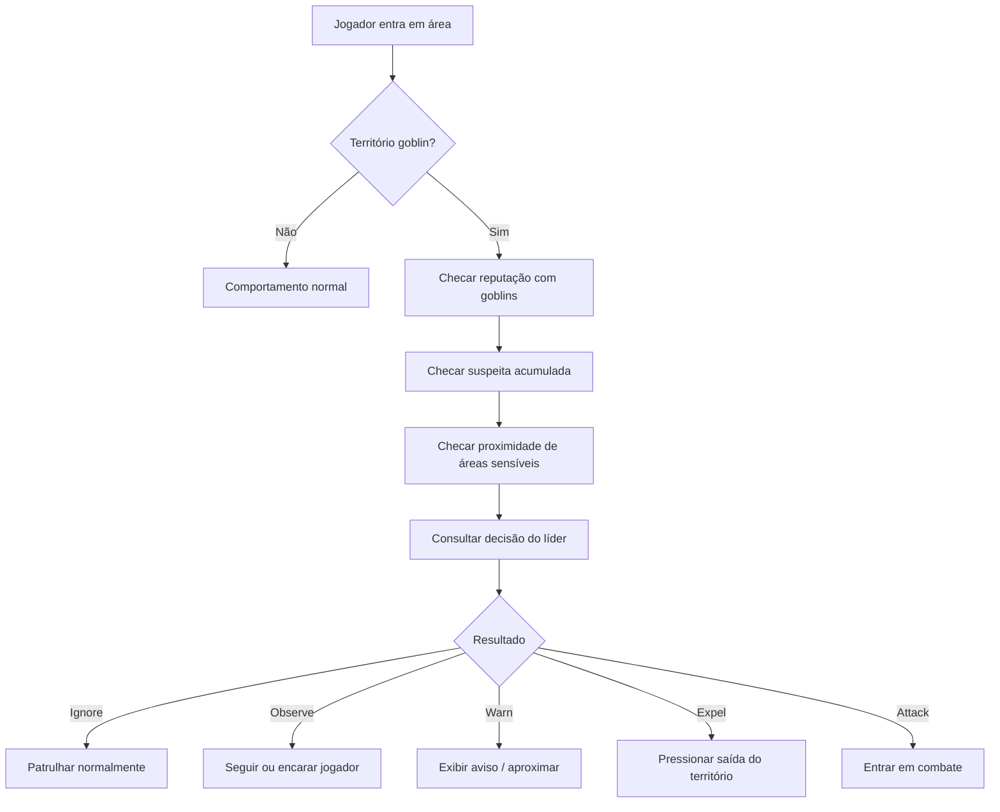

# Planejamento — Reestruturação da IA, Facções, Guerra Territorial e Família Goblin

## Objetivo

Reestruturar o comportamento social e territorial do jogo para substituir o modelo atual de múltiplas famílias goblins por um sistema mais controlado, com:

- apenas **1 família goblin** por enquanto
- sistema de **facções**
- jogador começando **neutro** com **Humanos** e **Goblins**
- IA baseada em **território + suspeita + reputação**
- ataque não mais imediato ao ver o jogador
- liderança goblin tomando decisões contextuais
- guerra territorial entre facções
- avanço e recuo de fronteiras com base em progresso de facção
- quests separadas entre **progressão do jogador** e **progressão da facção**

---

## Visão de design

A ideia principal é fazer o mundo parecer menos binário e mais vivo.

O jogador não deve mais ser tratado como inimigo automático.

Em vez disso:

- o jogador entra no mundo como uma força externa
- humanos e goblins observam o comportamento dele
- reputação muda conforme ações
- territórios geram tensão
- líderes decidem quando tolerar, alertar ou atacar
- quests influenciam o avanço político e militar das facções
- territórios podem mudar de dono
- invasões passam a ter consequência real no mapa

Isso cria um mundo mais político, mais dinâmico e mais legível para o jogador.

---

## Novo modelo social

### Facções iniciais

```text
- HUMANOS
- GOBLINS
```

### Estado inicial do jogador

```text
Humans: Neutro
Goblins: Neutro
```

### Regra principal

Enquanto o jogador estiver neutro:

- humanos não atacam à vista
- goblins não atacam à vista
- entrar em território alheio não gera combate imediato
- mas gera **suspeita**
- reputação positiva reduz suspeita
- reputação negativa acelera conflito

---

## Mudança central na IA

Antes:

- viu o player -> pode perseguir -> combate rápido

Agora:

- viu o player -> avaliar reputação
- avaliar território atual
- avaliar nível de invasão/suspeita
- avaliar decisão do líder/facção
- avaliar estado da guerra territorial
- só então decidir entre:
  - ignorar
  - observar
  - alertar
  - escoltar para fora
  - atacar

---

## Camadas do novo sistema

# 1. Sistema de facções

Criar uma camada global de facções separada da IA individual.

### Responsabilidades

- armazenar reputação do jogador com cada facção
- aplicar ganhos/perdas por ação
- fornecer estado atual da relação
- rastrear progresso de guerra
- definir controle territorial
- permitir futuro suporte a alianças, guerra, neutralidade e comércio

### Estruturas sugeridas

```text
FactionType
- HUMANS
- GOBLINS
```

```text
FactionStanding
- HATED
- HOSTILE
- UNWELCOME
- NEUTRAL
- TOLERATED
- FRIENDLY
- ALLIED
```

```text
FactionRelationManager
- getStanding(FactionType)
- addReputation(FactionType, amount)
- removeReputation(FactionType, amount)
- isHostile(FactionType)
- isFriendly(FactionType)
```

### Exemplo de reputação numérica

```text
<= -75  -> HATED
-74 a -40 -> HOSTILE
-39 a -10 -> UNWELCOME
-9 a 9 -> NEUTRAL
10 a 39 -> TOLERATED
40 a 74 -> FRIENDLY
>= 75 -> ALLIED
```

---

# 2. Sistema de território

O território deixa de ser apenas área de spawn e passa a influenciar decisões sociais, militares e de expansão.

### Tipos de território

```text
- HUMAN_SETTLEMENT
- HUMAN_FRONTIER
- GOBLIN_TERRITORY
- GOBLIN_FRONTIER
- NEUTRAL_WILDS
- CONTESTED_ZONE
- SPECIAL_AREA
```

### Controle territorial

Cada mapa ou zona deve ter:

- facção controladora atual
- nível de estabilidade
- mapas vizinhos
- presença de defensores
- nível de ameaça
- valor estratégico

### Regras iniciais

#### Território humano
- goblins não spawnam naturalmente
- só aparecem por **raid** se houver mapa vizinho goblin
- humanos geram guardas para patrulha e defesa
- jogador neutro pode circular com suspeita moderada em áreas sensíveis

#### Território goblin
- humanos não devem dominar a área sem progressão de guerra
- goblins patrulham naturalmente
- jogador neutro é tolerado por tempo limitado
- áreas próximas ao líder/cabana são mais sensíveis

#### Zona neutra
- sem controle fixo no início
- ideal para transição entre facções
- pode ser convertida em fronteira humana ou goblin
- boa área para início de expansão gradual

---

# 3. Expansão de território por progressão de facção

## Ideia central

O território goblin deve começar no **vilarejo goblin** e avançar gradualmente em direção ao **vilarejo humano**.

O território humano deve fazer o mesmo no sentido oposto.

Essa progressão não acontece sozinha:
ela depende da atuação do jogador em **quests de progressão de facção**.

## Regra principal

Cada facção terá uma espécie de **linha de frente**.

Essa linha de frente avança ou recua com base em:
- quests de facção concluídas
- sucesso/fracasso de raids
- perda de guardas
- perda de território
- defesa bem-sucedida
- estabilidade local

### Modelo sugerido

Cada território tem um valor:

```text
TerritoryControl
- ownerFaction
- controlStrength
- defenseStrength
- adjacentTerritories
- contested
```

### Exemplo simplificado

```text
Vilarejo Goblin -> Zona Goblin -> Zona Neutra -> Zona Humana -> Vila Humana
```

Conforme os goblins avançam:
- a zona neutra pode virar fronteira goblin
- depois território goblin estabilizado
- depois área de raid contra território humano vizinho

Conforme os humanos avançam:
- o mesmo ocorre no sentido oposto

---

# 4. Sistema de quests dividido em dois tipos

Esse ponto é central e faz muito sentido.

Todas as quests continuam afetando reputação, mas nem todas afetam a guerra.

## Tipo 1 — Quest de progressão do jogador

Essas quests servem para:
- XP
- ouro
- itens
- favorabilidade com facção
- desbloqueios pessoais
- narrativa local
- comércio e acesso a NPCs

### Exemplos
- entregar suprimentos
- caçar uma ameaça local
- recuperar item perdido
- limpar estrada
- ajudar um mercador
- conversar com um líder

### Efeito
- aumenta reputação/favorabilidade
- não muda diretamente a fronteira entre facções

---

## Tipo 2 — Quest de progressão de facção

Essas são as quests que alteram a guerra territorial.

### Elas servem para:
- fortalecer defesa de uma facção
- preparar expansão
- enfraquecer território rival
- abrir caminho para raid
- consolidar território recém-conquistado

### Exemplos
- destruir posto avançado rival
- defender patrulha da facção
- levar armas para a fronteira
- eliminar capitão inimigo
- recuperar bandeira/relíquia militar
- escoltar reforços
- sabotar provisões da facção rival

### Efeito
- aumenta reputação com a facção
- altera pontuação de guerra
- influencia raid
- influencia controle territorial
- pode mudar dono de território

## Estrutura sugerida

```text
QuestType
- PLAYER_PROGRESSION
- FACTION_PROGRESSION
```

```text
QuestFactionImpact
- reputationGain
- warProgressGain
- territoryTarget
- unlockRaid
- reinforceDefense
- weakenEnemyPresence
```

---

# 5. Sistema de suspeita / invasão

Esse é o coração do comportamento local.

O jogador neutro não apanha ao entrar, mas pode gerar suspeita se permanecer, explorar demais ou se aproximar de pontos sensíveis.

### Conceito

Cada facção/território pode acumular um valor de suspeita do jogador.

### Fontes de suspeita

- entrar em território restrito
- ficar muito tempo dentro da área
- se aproximar da cabana/líder
- abrir baús/objetos locais
- entrar em áreas internas
- destruir estrutura
- sacar arma perto do líder
- atacar membro da facção
- interferir em patrulha ou raid

### Redução de suspeita

- sair do território
- ficar parado em área permitida
- completar quest da facção
- conversar com NPC correto
- ter reputação positiva
- obedecer ordem de retirada

### Estados sugeridos

```text
0-19   -> Ignorado
20-39  -> Observado
40-59  -> Alertado
60-79  -> Expulsão / intimidação
80+    -> Ataque autorizado
```

---

# 6. Liderança e decisão de ataque

O líder não deve ser só um combatente mais forte.

Ele passa a ser uma entidade que influencia a postura da facção.

### O líder goblin deve poder decidir:

- tolerar presença do jogador
- mandar vigiar
- mandar expulsar
- autorizar ataque
- recuar conflito se o jogador for respeitado
- liberar raid
- reforçar território em risco

### Entradas para decisão do líder

- reputação do jogador com goblins
- suspeita acumulada
- local atual do jogador
- se o jogador está armado/agressivo
- se o jogador matou goblins antes
- se o jogador ajudou goblins antes
- pressão da fronteira
- vizinhança de territórios humanos
- estado da guerra

### Saídas

```text
LeaderDecision
- IGNORE
- OBSERVE
- WARN
- EXPEL
- ATTACK
- PREPARE_RAID
- REINFORCE_BORDER
```

---

# 7. Reestruturação dos goblins

## Regra temporária

Remover o conceito de múltiplas famílias por agora.

Fica apenas:

```text
GoblinFamily principal
- 1 líder
- membros combatentes
- território principal
- reputação da facção goblin
- progressão militar
```

### Por que isso é bom agora

- reduz complexidade
- facilita testar IA social e territorial
- evita guerra entre famílias atrapalhando o novo sistema
- deixa espaço para voltar com múltiplas famílias depois

### O que deve sair ou ser desativado por enquanto

- guerra entre famílias
- múltiplas cabanas rivais
- spawn de novas famílias
- conselho goblin macro
- império goblin automático

### O que permanece

- líder
- membros com personalidades
- território
- patrulha
- sistema de ataque com telegraphing
- comportamento social básico
- papel militar na guerra de facções

---

# 8. Sistema de fronteira e mapas vizinhos

Esse é um ponto novo e muito importante.

A captura e a guerra só fazem sentido se os territórios respeitarem **adjacência**.

## Regra principal

Uma facção só pode:
- fazer raid em um território inimigo
- contestar território inimigo
- tentar capturar território

se existir **mapa vizinho controlado por ela** conectado àquele território.

## Consequência prática

- goblins não spawnam em território humano do nada
- humanos não surgem no coração do território goblin sem avanço
- o sistema de guerra passa a parecer geográfico e lógico

## Estrutura sugerida

```text
TerritoryNode
- territoryId
- ownerFaction
- neighborIds
- canRaidFrom(FactionType)
- canBeInvadedBy(FactionType)
```

---

# 9. Sistema de raids

## Regra principal

Goblins não spawnam em mapas humanos,
a menos que o território humano tenha **mapa vizinho controlado por goblins**.

Nesse caso, os goblins podem iniciar uma **raid**.

O mesmo vale para humanos no futuro.

## O que é uma raid

Uma raid é uma investida temporária de ataque com o objetivo de:
- matar NPCs defensores
- enfraquecer o território
- reduzir estabilidade
- abrir chance de captura

## Condições para raid goblin

- território humano é vizinho de território goblin
- progresso de guerra goblin suficiente
- facção goblin tem força disponível
- território humano não está excessivamente defendido
- raid não está em cooldown

## Comportamento durante raid

Os goblins:
- entram pelo lado vizinho coerente
- focam guardas/NPCs defensores
- ignoram o jogador neutro se ele não interferir
- atacam jogador se ele proteger defensores humanos
- recuam se a raid falhar

## Resultado da raid

### Se a raid falhar
- goblins perdem força ofensiva
- humanos ganham estabilidade
- território continua humano

### Se a raid vencer
- guardas defensores morrem
- estabilidade do território cai
- território entra em estado contestado
- com nova pressão ou ausência de defesa, o território pode mudar de dono

---

# 10. Sistema de guardas por controle territorial

Esse sistema deve existir para as duas facções.

## Regra principal

Quando uma facção controla um território, ela gera NPCs defensores para:
- patrulhar
- defender
- responder a raids
- manter presença local

## Exemplos

### Território humano
- guardas humanos
- patrulha regular
- defesa de entradas
- reação a raids goblins

### Território goblin
- sentinelas goblins
- patrulha em torno da cabana/centro
- defesa de entradas
- reação a incursões humanas

## Estrutura sugerida

```text
TerritoryDefenseProfile
- ownerFaction
- guardSpawnPoints
- patrolRoutes
- defenseStrength
- respawnPolicy
```

---

# 11. Sistema de captura de território

## Regra principal

Um território não muda de dono só porque foi atacado.
Ele muda de dono quando:
- os defensores são derrotados
- a estabilidade cai abaixo do limite
- a facção atacante tem conexão por território vizinho
- a captura é validada pelo sistema de guerra

## Fluxo sugerido



## Estados sugeridos

```text
TerritoryState
- STABLE
- UNDER_PRESSURE
- CONTESTED
- CAPTURED_RECENTLY
- FORTIFIED
```

---

# 12. Novo fluxo de decisão dos goblins



---

# 13. Comportamento humano

Os humanos devem seguir a mesma lógica estrutural, mesmo que mais simples no começo.

### Humanos neutros
- não atacam o jogador à vista
- observam se ele estiver em local sensível
- podem barrar áreas restritas

### Humanos favoráveis
- oferecem quests
- liberam loja/ajuda
- reduzem suspeita em território humano
- ajudam a defender fronteiras humanas

### Humanos hostis
- guardas atacam ou expulsam
- comerciantes recusam serviço
- áreas seguras deixam de ser seguras para o jogador
- jogador pode ser tratado como colaborador goblin

---

# 14. Ações que alteram reputação

## Favor goblin
- completar quest goblin
- ajudar território goblin
- matar inimigos dos goblins
- poupar membros goblins
- devolver item/recursos
- defender raid goblin
- ajudar expansão goblin

## Contra goblin
- matar goblins
- destruir cabana
- roubar área sensível
- invadir repetidamente
- atacar líder
- defender território humano durante raid goblin

## Favor humano
- completar quest da vila
- defender NPCs
- eliminar ameaça aos aldeões
- proteger comércio
- defender território humano
- ajudar guardas durante raid

## Contra humano
- atacar guarda
- roubar vila
- matar NPCs aliados
- ajudar facção inimiga contra humanos
- sabotar defesa territorial humana

---

# 15. Estruturas sugeridas

## Novas enums

```text
FactionType
FactionStanding
TerritoryType
LeaderDecision
SuspicionState
QuestType
TerritoryState
RaidState
```

## Novas classes

```text
FactionRelationManager
FactionWarManager
FactionProfile
TerritoryProfile
TerritoryTracker
TerritoryNode
PlayerSuspicionTracker
GoblinLeaderBrain
RaidManager
RaidPlan
TerritoryDefenseProfile
FactionEvent
```

## Classes existentes para adaptar

```text
Goblin
GoblinFamily
EnemyManager
MapManager / TileMap
GuardNPC
MerchantNPC
Player
Quest / QuestManager
```

---

# 16. Regras práticas de implementação

## Fase 1 — Base de facções
- [ ] Criar `FactionType`
- [ ] Criar `FactionStanding`
- [ ] Criar `FactionRelationManager`
- [ ] Adicionar reputação inicial neutra para humanos e goblins
- [ ] Criar métodos de ganho/perda de reputação

## Fase 2 — Uma única família goblin
- [ ] Remover múltiplas famílias por enquanto
- [ ] Remover guerras entre famílias
- [ ] Remover respawn de novas famílias
- [ ] Manter apenas 1 cabana + 1 líder + membros
- [ ] Adaptar `EnemyManager` para spawnar só essa família

## Fase 3 — Território e suspeita
- [ ] Criar noção de tipo de território
- [ ] Marcar zona goblin como território sensível
- [ ] Criar valor de suspeita por facção ou área
- [ ] Aumentar suspeita quando jogador invade áreas críticas
- [ ] Reduzir suspeita ao sair/esperar/completar ação positiva

## Fase 4 — Quests separadas por tipo
- [ ] Criar `QuestType`
- [ ] Separar quest de jogador e quest de facção
- [ ] Fazer ambas alterarem reputação
- [ ] Fazer apenas `FACTION_PROGRESSION` alterar guerra territorial

## Fase 5 — Sistema de guerra territorial
- [ ] Criar controle de território por facção
- [ ] Criar adjacência entre mapas
- [ ] Criar progresso de guerra por facção
- [ ] Definir como avanço territorial acontece
- [ ] Definir estado contestado

## Fase 6 — Sistema de raids
- [ ] Criar `RaidManager`
- [ ] Permitir raid apenas entre territórios vizinhos
- [ ] Bloquear spawn arbitrário de goblins em território humano
- [ ] Fazer raid focar defensores locais
- [ ] Definir vitória/derrota da raid

## Fase 7 — Defensores por território
- [ ] Gerar guardas humanos em território humano
- [ ] Gerar sentinelas goblins em território goblin
- [ ] Criar patrulha por território
- [ ] Se defensores morrerem, reduzir estabilidade do território

## Fase 8 — Captura de território
- [ ] Criar estados do território
- [ ] Fazer território entrar em `CONTESTED`
- [ ] Se a defesa cair e houver pressão vizinha, trocar dono
- [ ] Gerar nova patrulha da facção vencedora

## Fase 9 — Decisão do líder
- [ ] Criar `GoblinLeaderBrain`
- [ ] Fazer líder decidir entre ignorar, observar, alertar, expulsar, atacar e preparar raid
- [ ] Usar reputação + suspeita + posição + estado da guerra como entrada

## Fase 10 — Reestruturação da IA dos goblins
- [ ] Tirar ataque automático à vista quando neutro
- [ ] Criar estado de observação
- [ ] Criar estado de aviso
- [ ] Criar estado de expulsão
- [ ] Entrar em combate só quando autorizado

## Fase 11 — Humanos com mesma base
- [ ] Guardas usando reputação humana
- [ ] Vila reagindo ao jogador conforme standing
- [ ] Loja e quests dependentes de favorabilidade
- [ ] Humanos participando da disputa territorial

---

# 17. Estados sugeridos para IA local dos goblins

```text
GoblinState
- PATROL
- OBSERVE
- WARN
- ESCORT_OUT
- ATTACK
- FLEE
- RETURN_HOME
- RAID_ATTACK
- DEFEND_TERRITORY
```

### Regras básicas

#### PATROL
estado padrão no território

#### OBSERVE
quando jogador neutro entra na área

#### WARN
quando suspeita sobe ou jogador se aproxima demais

#### ESCORT_OUT
quando jogador insiste em permanecer

#### ATTACK
quando standing é hostil ou suspeita passa do limite

#### FLEE
mantém lógica da personalidade tímida

#### RETURN_HOME
quando perde alvo ou tensão diminui

#### RAID_ATTACK
quando o goblin participa de investida em território vizinho

#### DEFEND_TERRITORY
quando território goblin está sob ataque

---

# 18. Interface / feedback para o jogador

Esse sistema só funciona bem se o jogador entender o que está acontecendo.

### Adicionar feedback visual ou textual

- indicador de reputação por facção no menu
- mensagem curta ao entrar em território sensível
- aviso quando suspeita subir
- frase do líder ou guardas avisando para sair
- feedback quando reputação mudar
- indicador de território controlado no mapa mundi
- aviso de território contestado
- aviso de raid em andamento

### Exemplos

```text
"Os goblins estão observando você."
"Você está entrando em território goblin."
"Sua presença está se tornando indesejada."
"O líder goblin ordenou sua retirada."
"Reputação com Goblins aumentou."
"Território humano sob ataque."
"A facção goblin está pressionando a fronteira."
"Território agora contestado."
```

---

# 19. Vertical slice dessa reestruturação

A primeira versão desse novo sistema deve ser pequena.

### Slice recomendado

- 1 vila humana
- 1 território goblin
- 1 zona neutra entre os dois
- 1 família goblin
- 1 líder goblin
- 1 guarda humano
- player neutro com ambos
- entrar no território goblin não gera combate automático
- permanecer perto da cabana aumenta suspeita
- líder manda avisar
- insistir gera ataque
- matar goblins reduz reputação
- completar uma quest simples aumenta reputação
- 1 quest de progressão de facção destrava aumento de pressão territorial
- 1 raid simples entre territórios vizinhos
- se guardas do território forem mortos, território entra em estado contestado

Se esse slice funcionar, a base da nova IA e da guerra territorial está validada.

---

# 20. O que fica para depois

Depois dessa base pronta, dá para evoluir para:

- múltiplas famílias goblins novamente
- guerra entre famílias
- mercado negro goblin
- fazendeiros e civis goblins
- império goblin
- reputação mais granular
- comércio exclusivo por facção
- invasões maiores
- quests diplomáticas
- ocupação prolongada
- retomada de território por reconquista
- eventos dinâmicos de fronteira

---

# 21. Definição de sucesso

Essa reestruturação será bem-sucedida quando:

- goblins não forem mais agressivos automaticamente
- o território influenciar o comportamento
- o líder realmente parecer tomar decisões
- reputação alterar o tratamento do jogador
- quests de facção alterarem a guerra
- raids só acontecerem por adjacência territorial
- defensores locais realmente importarem
- território puder mudar de dono de forma legível
- humanos e goblins seguirem regras parecidas
- o sistema parecer político/social, não apenas combativo

---

# 22. Resumo final

A meta não é só reduzir para uma família goblin.

A meta é trocar o modelo atual de:

**"inimigo vê jogador e ataca"**

por um modelo de:

**"facção avalia jogador, território, histórico e contexto antes de agir"**

e evoluir isso para:

**"facções disputam território por fronteira, raids, defesa local e progressão militar influenciada pelo jogador"**

Esse é o passo que transforma goblins e humanos em sociedades do mundo, e não apenas grupos de combate.
